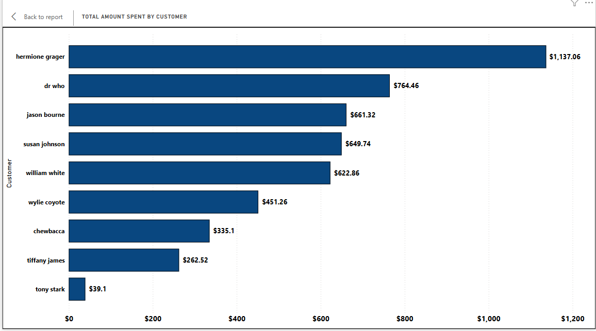

# smart-store-sowers

## Purpose  
Practice completing a business intelligence project for a client. 

## Step 1: New Project Setup
1. Initialize Repository: Create a new GitHub repository with this format **smart-store-sowers** with a default `README.md`
2. Clone the repository to your local machine in the **Projects** folder
3. Open the project folder in **VS Code**

## Step 2: Add Essential Files
1. **.gitignore**: Add a `.gitignore` file to specify files and folders to exclude from version control. You can reference an existing `.gitignore` template for Python projects.
2. **requirements.txt**: This file lists all necessary packages for the project. Review and adjust it to include or exclude packages based on your project’s needs.
3. **README.md**: Edit README.md to record commands, process, and notes so far as the project progresses.
4. 5. This is good time to `git add .`, `git commit -m "Message"`, `git push -u origin main` files to GitHub

## Step 3: Create and Manage Virtual Environment
1. Run command: `git pull` first, to make sure the current project contents are on the machine.
2. Windows PowerShell: `python -m venv .venv` to create a new .venv environment in the project repo.
3. Activate the Virtual Environment: `.\.venv\Scripts\activate`

## Step 4: Install Required Packages
1. `pip install -r requirements.txt` to install all packages at one time from a file
2. `py -m pip install` to add packages on the go (e.g. `py -m pip install pandas`)
3. `pip install numpy pandas matplotlib seaborn` for multiple packages

## Step 5: Select Python Interpreter in VS Code
1. Ensure VS Code is set to use the .venv environment.
2. Open the command palette using (Windows) Ctrl + Shift + P.
3. Type "Python: Select Interpreter".
4. Choose the interpreter inside the .venv folder located in the project root directory.
5. This is good time to `git add .`, `git commit -m "Message"`, `git push -u origin main` files to GitHub

## Git Commands Reminders 
1. Pull Latest Changes:  `git pull`
2. Add Changes: `git add .`
3. Commit Changes: 5. `git commit -m "Update message"` update commit message a present tense verb
4. Push Changes to GitHub: `git push -u origin main` and then afterwards `git push`
   
## Verify Git Configuration: Check that both user.name and user.email are correctly configured
1. git config --list

## VS Code Extensions:
1. SQLite
2. SQLite Viewer
3. Jupyter
4. Prettier
5. Markdown All in One
6. Rainbow CSV

## Running a Python file (ex: data_prep.py stored in the scripts subfolder of project directory)
1. py scripts\data_prep.py

# Dimension Table: customer
| column_name             | data_type | description               |
|-------------------------|-----------|---------------------------|
| customer_id             | TEXT      | Primary key               |
| name                    | TEXT      | Customer’s full name      |
| region                  | TEXT      | Customer's region         |
| join_date               | DATE      | Join date                 |
| loyalty_points          | INTEGER   | Loyalty program points    |
| preferred_contact_method| TEXT      | Contact preference        |

# Dimension Table: product
| column_name    | data_type | description              |
|----------------|-----------|--------------------------|
| product_id     | TEXT      | Primary key              |
| product_name   | TEXT      | Name of the product      |
| category       | TEXT      | Product category         |
| unit_price     | REAL      | Price per unit           |
| stock_quantity | INTEGER   | Product stock quantity   |
| store_section  | TEXT      | Store section location   |

# Fact Table: sale
| column_name      | data_type | description                     |
|------------------|-----------|---------------------------------|
| transaction_id   | TEXT      | Primary key                     |
| sale_date        | DATE      | Date of the transaction         |
| customer_id      | TEXT      | Foreign key to customers        |
| product_id       | TEXT      | Foreign key to products         |
| store_id         | TEXT      | Store where purchase occurred   |
| campaign_id      | TEXT      | Marketing campaign ID           |
| sale_amount      | REAL      | Total sale amount               |
| discount_percent | REAL      | Discount applied to the sale    |
| payment_type     | TEXT      | Type of payment (e.g., credit)  |

# The database consists of three main tables with a star schema structure:
- customer (dimension)
- product (dimension)
- sale (fact)

# The sale table includes foreign keys referencing the customer and product tables to ensure each sale is tied to valid dimension data.
- All primary keys are TEXT to match the data in the CSVs.
- Foreign key constraints were enabled with PRAGMA foreign_keys = ON.
- The schema enforces referential integrity between related records.

# The screenshots below shows that all three tables in the `smart_sales.db` file were successfully populated:

# Challenge Encountered: Foreign key constraint errors
- Issue: Some records in the sales dataset referenced customer_ids or product_ids that were missing from the cleaned customers or products tables.
- Solution: Added filtering logic to the etl_to_dw.py script to exclude any sales records where the customer_id or product_id was missing in the corresponding dimension tables.
This ensured that foreign key constraints would not be violated during insertion into the sale table.
  
# Challenge Encountered: Column mismatches after cleaning
- Issue: The original CSVs had PascalCase headers that needed to be converted to snake_case to match the database schema.
- Solution: Converted all headers to  match the database schema. 

# Power BI Sales Dashboard Report
This Power BI dashboard provides an overview of product revenue and customer spending over a selected date range. It allows for slicing, dicing, and analysis of sales trends by product, customer, category, region, and time.

## Date Filter
**Sales Date Slicer (Top Left)**  
A range slicer is used to filter the entire dashboard by sales date. This allows users to view performance metrics within a specific time period.

## Regional Sales Table
**Category Sales by Region (Top Left Table)**  
This matrix visual breaks down total sales by product category (Clothing, Electronics, Sports) across four geographic regions (East, North, South, West). It includes row-level totals and a grand total to show cumulative sales performance.

## Customer Spending
**Total Amount Spent by Customer (Top Right Bar Chart)**  
A horizontal bar chart displaying the total amount spent by each customer in descending order. This chart highlights top customers and helps identify key revenue drivers.

## Monthly Sales Trend
**Total Sale Amount by Month (Bottom Left Column Chart)**  
A column chart showing the total sales amount grouped by month. The x-axis is sorted by calendar order and also displays the quarter and year. This helps visualize monthly fluctuations in sales performance.

## Top Products by Revenue
**Top Revenue Products (Bottom Right Line and Area Chart)**  
A combined line and area chart ranking products by total revenue in descending order. This visual highlights the highest-grossing products and helps prioritize inventory or promotional strategies.

## Dashboard Notes
- All visuals respond to the selected Sales Date filter.
- The data has been transformed in Power Query to extract Year, Quarter, Month Name, and Month Number from the sale date field.
- Month Name is sorted by Month Number to ensure correct chronological display.